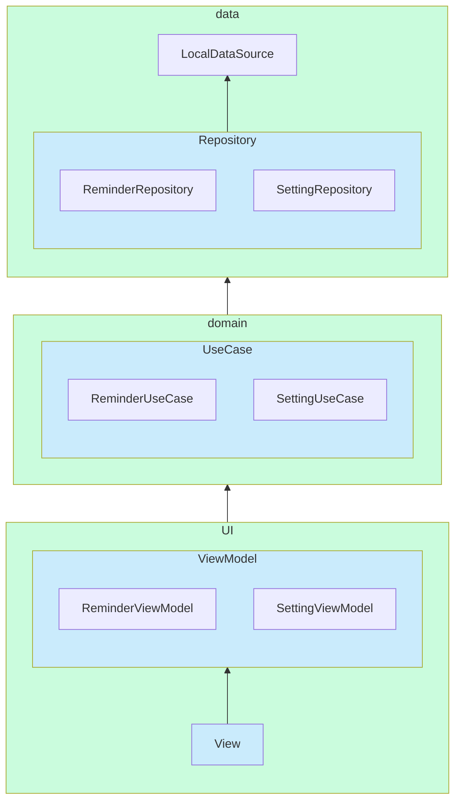

## コンタクトレンズ交換リマインダー

[Play Store](https://play.google.com/store/apps/details?id=io.github.rikuyu.contactlensreminder)

### 使用技術・ツール等
- Jetpack Compose
- Dagger-Hilt
- Navigation
- Pager
- AlarmManager
- Notification

- Robolectric
- MockK
- Truth

- Firebase-Crashlytics
- Github Actions
- ktlint
- Danger

### アーキテクチャ

[アプリ アーキテクチャ ガイド](https://developer.android.com/jetpack/guide?hl=ja) を手本にした。
### 工夫点
- 説明を見なくても操作方法の分かるUIデザイン
- 毎日アプリアイコンを変えること
- Unit Test

### その他
- [ブログ](https://www.yuuuki-blog.com/2022/02/13/Android-%E3%82%A2%E3%83%97%E3%83%AA%E3%82%A2%E3%82%A4%E3%82%B3%E3%83%B3%E3%82%92%E5%8B%95%E7%9A%84%E3%81%AB%E5%A4%89%E3%81%88%E3%82%8B%E6%96%B9%E6%B3%95/)
